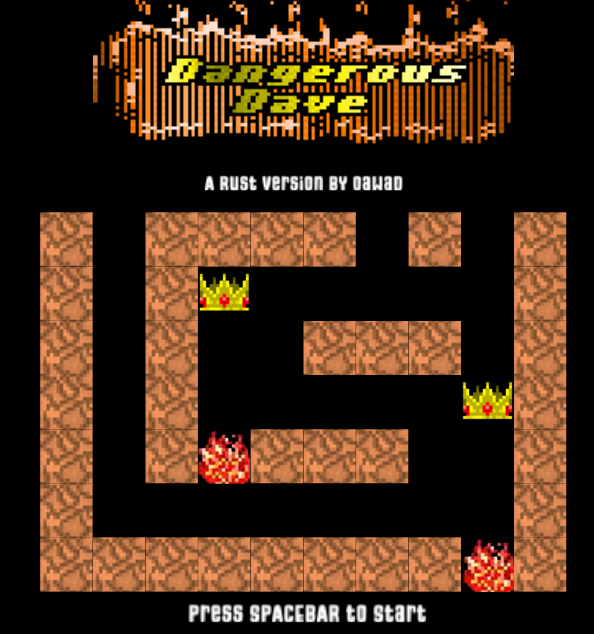

# Dangerous Dave - Rust Edition

A 2D platformer game written in Rust using macroquad, inspired by the classic "Dangerous Dave" game.



## 🎮 About

Dave-RS is a remake of the classic DOS game "Dangerous Dave" implemented in Rust. Navigate through levels, avoid monsters, collect items, and find your way to the exit door in this action platformer.

## ✨ Features

- Classic platformer gameplay
- Monster AI with customizable waypoints and behaviors
- Shooting mechanics
- Tiled map integration for level design
- Custom rotation effects for enemies

## 🔧 Requirements

- Rust (latest stable version)
- Cargo package manager
- Compatible OS: Windows, macOS, or Linux

## 🚀 Building and Running

Clone the repository:
```bash
git clone https://github.com/oawad79/dave-rs.git
cd dave-rs
```

Build and run the game:
```bash
cargo run --release
```

For development:
```bash
cargo run
```

You might encounter an issue with Rust feature 2024, you can maybe just adjust the cargo file to have the 2021 without any issues. otherwise you can do this instead

```bash
rustup default nightly
```

## 🎯 How to Play

- **Arrow Keys**: Move & Jump
- **Left Alt**: Jet Pack
- **Left Ctrl** : Shoot
- **ESC**: Pause/Menu
- **F1**: Help 
- **Ctrl-A**: Toggle Full/Windowed Mode
- **Ctrl-[1-9, 0]**: Cheats to Skip to levels, 0 for Level 10  

## 🛠️ Technical Details

The game is built with:
- **[Rust](https://www.rust-lang.org/)**: Programming language
- **[macroquad](https://github.com/not-fl3/macroquad)**: 2D game framework
- **[macroquad-tiled](https://github.com/not-fl3/macroquad-tiled)**: Tiled map integration
- **[Tiled Map Editor](https://www.mapeditor.org/)**: Tiled Editor

### Monster System

Monsters in the game follow custom waypoint paths defined in Tiled maps. They can:
- Move along predefined paths
- Rotate around different axes
- Shoot at the player when in range

### Level Design

Levels are created using the Tiled map editor, with custom properties to define:
- Monster placement and behavior
- Collectible items
- Player starting position
- Exit points

## 🔄 Development Status

This project is under active development. New features and improvements are being added regularly.

## 🙏 Credits

- Original "Dangerous Dave" game by John Romero
- Macroquad library by Fedor Logachev

## 🤝 Contributing

Contributions are welcome! Please feel free to submit a Pull Request.

1. Fork the repository
2. Create your feature branch (`git checkout -b feature/amazing-feature`)
3. Commit your changes (`git commit -m 'Add some amazing feature'`)
4. Push to the branch (`git push origin feature/amazing-feature`)
5. Open a Pull Request
